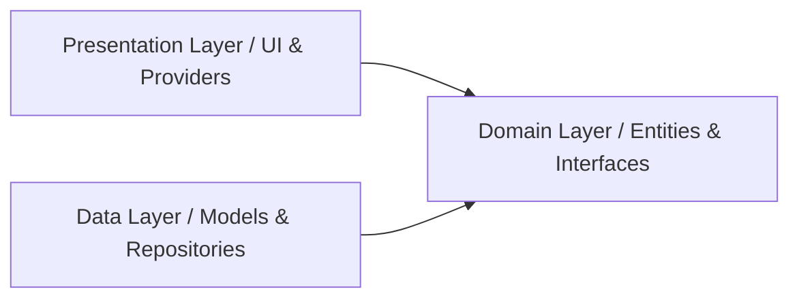

# Engineering Standards & Development Rules (Rules.md)

This document establishes the coding rules, naming guidelines, architectural rules, and quality standards for NZXTGEN OS. Compliance with these rules is mandatory.

---

## 1. Core Language & Framework Rules

- **Null Safety**: 100% sound null safety is required. Never use the bang operator (`!`) unless checking for nullity immediately beforehand or inside a local scope validation block. Prefer using conditional member access (`?.`) or default fallback operators (`??`).
- **Strong Typing**: Dynamic types are banned. Specify exact types for variable declarations, function parameters, and return types. Turn on strong-mode checks in `analysis_options.yaml`.
- **Lint Enforcement**: Flutter lint recommendations must be resolved. The codebase must compile with zero warnings or errors.

---

## 2. Directory & Coding Architecture
We enforce a **Feature-First Clean Architecture** folder structure.

### 2.1 File Layer Separation
- **Presentation Layer**: Contains widgets, layouts, animations, and ChangeNotifier/Provider controllers. Controllers must handle UI state mappings and communicate with Domain Repositories.
- **Domain Layer**: Contains plain Dart business entities and repository abstract definitions. Keep this layer free of external dependencies (e.g., direct references to `supabase_flutter`).
- **Data Layer**: Contains API clients, models (which extend Domain Entities and serialize/deserialize JSON), local storage handlers, and concrete Repository implementations.



### 2.2 Strict Architectural Rules
1. **Dependency Direction**: The presentation and data layers depend on the domain layer. The domain layer must never import files from presentation or data.
2. **Feature Isolation**: Features must communicate only through public interfaces. Avoid direct relative imports across feature directories (e.g. `import '../../auth/presentation/widget'` from `features/services/`). Use package imports and core abstractions instead.
3. **No Hardcoded Business Logic**: Magic numbers, hardcoded API links, and raw business logic are prohibited in widgets. Extract these to configuration constants (`core/theme` or `core/utils`) or class methods inside Providers.

---

## 3. UI & Styling Guidelines

- **Responsive Design**: All UI layout elements must adapt to screen resize parameters.
  - Do not hardcode media query dimensions directly (e.g., `MediaQuery.of(context).size.width - 200`). Use helper layouts like `LayoutBuilder` or custom extensions (`context.isMobile`, `context.isTablet`).
  - Use flexible grids and layout widgets (`Expanded`, `Flexible`, `Spacer`) for layout sizing.
- **Reusable Widgets**: Avoid large build methods. If a widget extends beyond 150 lines, split it into smaller, stateless sub-widgets or private building methods.
- **Theme Conformity**: Access colors, fonts, and styles strictly through `Theme.of(context)` to maintain dynamic design rules. No raw color values (e.g., `Color(0xFF00E5FF)`) inside widget files.
- **Const Constructors**: Use `const` constructors wherever possible to optimize rendering cycles.

---

## 4. Naming Conventions

To keep the codebase consistent:

| Asset / Code Element | Pattern | Case Style | Example |
| :--- | :--- | :--- | :--- |
| **Directory / Folder** | Single feature or layer | `snake_case` | `project_updates` |
| **Source File** | Descriptive noun | `snake_case` | `glass_button.dart` |
| **Class Name** | Pascal Case | `PascalCase` | `ServiceDetailScreen` |
| **Variable / Field** | Camel Case | `camelCase` | `activeProjectCount` |
| **Method / Function** | Verb phrase | `camelCase` | `fetchServiceCatalog()` |
| **Enums / Extensions** | Pascal Case | `PascalCase` | `PaymentStatus` |
| **Global Constants** | Prefix `k` | `camelCase` | `kElectricCyan` |

---

## 5. State Management & Data Flow

- **Provider Single Responsibility**: Each ChangeNotifier must manage a single feature state area (e.g. `AuthProvider`, `BillingProvider`).
- **Separation of Concerns**: Do not call HTTP/Supabase queries directly inside widgets. The widget triggers a Provider method, which returns UI state changes through `notifyListeners()`.
- **Selector Optimization**: Use `Selector` instead of `Consumer` where possible to rebuild widgets only when specific fields within the Provider change.

---

## 6. Database & Backend Interaction

- **Row Level Security (RLS)**: Every new database table must have RLS enabled. Write explicit security policies for `select`, `insert`, `update`, and `delete` actions.
- **Foreign Key Triggers**: Implement cascading rules (`ON DELETE CASCADE` or `ON DELETE SET NULL`) on all foreign keys to prevent orphan database rows.
- **Date Audits**: Every table must contain `created_at` and `updated_at` columns with automatic timezone tracking (`timestamptz`). Implement a trigger to automatically update `updated_at` on modification:
```sql
CREATE OR REPLACE FUNCTION update_modified_column()
RETURNS TRIGGER AS $$
BEGIN
    NEW.updated_at = now();
    RETURN NEW;
END;
$$ language 'plpgsql';
```

---

## 7. Error Handling & Logs

- **Try-Catch Boundaries**: Wrap API calls in `try-catch` blocks inside the Data layer. Catch specific exceptions (e.g. `PostgrestException`, `AuthException`) and convert them into domain-specific failures (e.g. `ServerFailure`, `AuthFailure`).
- **User Feedback**: Propagate failures to the presentation layer. Show user-friendly errors in the UI using clean dialog overlays or status indicators.
- **Quiet Logs**: Do not use `print()` statements in production code. Use the `foundation` package's `debugPrint()` or a dedicated logging utility (e.g. `logger` package).

---

## 8. Development & Workflow Verification Rules

Before marking a task as complete:
1. **Lint Check**: Run `flutter lints` and fix all code style alerts.
2. **Format Check**: Run `flutter format .` to auto-align all file indentation.
3. **Automated Tests**: Execute `flutter test` to ensure all existing test suites continue to pass.
4. **Self-Review**: Verify the UI layout changes against the guidelines in `Design.md` across both narrow mobile and wide desktop widths.
