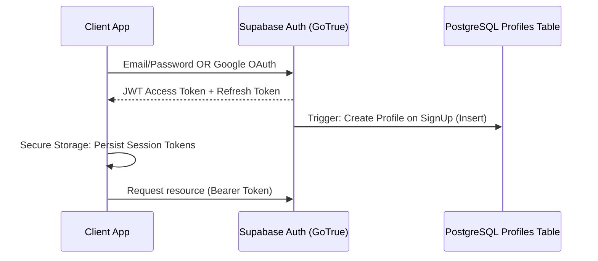

# Technical Specification (TechSpec)

## System Overview
NZXTGEN OS is designed as a secure, fast, and responsive digital services platform. It leverages a modern frontend decoupled from a robust backend-as-a-service (BaaS) infrastructure.

---

## 1. Core Technology Stack

### 1.1 Frontend: Flutter
- **Version**: Flutter SDK >= 3.0.0 (Null Safe, Strong Typing)
- **Platforms**: Android, iOS, Web (Production-optimized), Linux
- **Renderer**: CanvasKit (Web) for premium performance and glassmorphic UI execution.

### 1.2 Backend: Supabase
- **Service Stack**: Database (PostgreSQL), Auth (GoTrue), Storage, and Real-time Engines.
- **Protocol**: REST (via PostgREST) and WebSockets for real-time tracking updates.

### 1.3 State Management: Provider
- **Approach**: Feature-specific `ChangeNotifier` classes.
- **Workflow**: UI listens to `Selector` or `Consumer` widgets -> triggers methods on `Provider` -> Provider calls `Repository` -> Repository contacts `DataSource` -> returns typed Entity -> Provider updates state and calls `notifyListeners()`.

### 1.4 Navigation: GoRouter
- **Aesthetic Integration**: Declarative routing system with support for path parameters, query parameters, shell routes (for bottom navigation bar / dashboard layout), and redirect guards (for auth validation).

---

## 2. Directory & Architectural Pattern

The project implements **Feature-First Clean Architecture**. This structure groups code by feature (e.g., auth, services, projects) rather than technical layer, allowing features to be modular and scalable.

### 2.1 Directory Layout
```text
lib/
├── core/
│   ├── theme/          # App design tokens, glassmorphism templates, gradients
│   ├── network/        # Supabase Client setup, network state handlers
│   ├── errors/         # Custom failures, exceptions, and logger utilities
│   ├── utils/          # Formatting tools, validations, and helper extensions
│   └── widgets/        # Global reusable UI (Buttons, GlassCard, Loaders)
└── features/
    ├── auth/
    │   ├── data/       # Data sources, Auth API, Models
    │   ├── domain/     # Entities, Use Cases (optional/lean), Auth Repository interface
    │   └── presentation/# Controllers/Providers, Login/Signup Screens, widgets
    ├── services/
    │   ├── data/       # Services/Categories API, Models
    │   ├── domain/     # Service Entities, Repository Interface
    │   └── presentation/# Services catalog, details view, consultation booking
    ├── dashboard/
    │   ├── data/       # Project tracking, payments, invoices API, Models
    │   ├── domain/     # Project, Invoice, Payment, Ticket Entities & Interfaces
    │   └── presentation/# Dashboard layout, Project timeline, Payments, Invoices, Support
    └── admin/
        ├── data/       # Admin control API
        ├── domain/     # Admin-specific commands, client overview Entities
        └── presentation/# Admin dashboard, order details, ticket dispatcher
```

---

## 3. Authentication & Session Management

Authentication is managed via the **Supabase Auth GoTrue** client.



### 3.1 Sign-In Mechanisms
- **Email Authentication**: Standard sign-in and sign-up with email verification emails.
- **Google Authentication**: Native OAuth integration utilizing `google_sign_in` package for Android/iOS, and Supabase URI redirects for Web.
- **Session Persistence**: Automated token management. Access token is verified on app startup. If expired, the refresh token is exchanged in the background.

---

## 4. Database & Storage Architecture

### 4.1 Relational Engine
- **Engine**: Supabase PostgreSQL.
- **State Synchronization**: Database triggers (written in PL/pgSQL) automatically sync changes (e.g., creating a row in the `profiles` table when a new user registers via GoTrue).

### 4.2 Storage Buckets
Two primary storage buckets are established under Supabase Storage:
1. `client_attachments`: Private bucket containing project assets, wireframes, and design files uploaded by clients or team members.
2. `invoices`: Private bucket for PDF invoices generated by the system.
3. `public_assets`: Public bucket for category/service icons and promotional banner images.

---

## 5. Security & Row Level Security (RLS)

Security is enforced at the database level using Row Level Security (RLS). No API endpoint can bypass RLS rules unless using the service role key (restricted strictly to background backend tasks).

### 5.1 RLS Rules Policy Design

#### Users & Profiles Table
- **Read**: Logged-in users can view their own profile. Admins can view all profiles.
- **Write**: Users can update their own profile name, avatar, and contact info. Admins can update any profile.
```sql
ALTER TABLE public.profiles ENABLE ROW LEVEL SECURITY;
CREATE POLICY "Users can read own profile" ON public.profiles 
  FOR SELECT USING (auth.uid() = id);
CREATE POLICY "Admins can read all profiles" ON public.profiles 
  FOR SELECT USING (public.is_admin(auth.uid()));
```

#### Projects Table
- **Read**: Clients can only see projects where `client_id` matches their authenticated `auth.uid()`. Admins can read all projects.
- **Write**: Only admins can create/update projects.

#### Invoices & Payments Table
- **Read**: Clients can only view invoices linked to their account. Admins can read all.
- **Write**: Only system triggers or admins can create invoices/records.

#### Messages & Tickets Table
- **Read/Write**: Clients can read and write messages/tickets where they are the creator (`client_id = auth.uid()`). Admins can read and write to all tickets.

---

## 6. Secure API Design & Communication

- **HTTPS/WSS Protocols**: All client communications run over SSL.
- **SQL Injection Prevention**: Supabase client uses PostgREST, converting query commands into parameter-driven HTTP requests, completely neutralizing raw SQL injection vectors.
- **Rate Limiting**: Configured within the Supabase API Gateway to prevent DDoS vectors on authentication and public routes.
- **Error Obfuscation**: Production logs are shipped to a centralized tracking system (e.g., Sentry). The client application receives user-friendly, localized error messages, never raw system stack traces.
